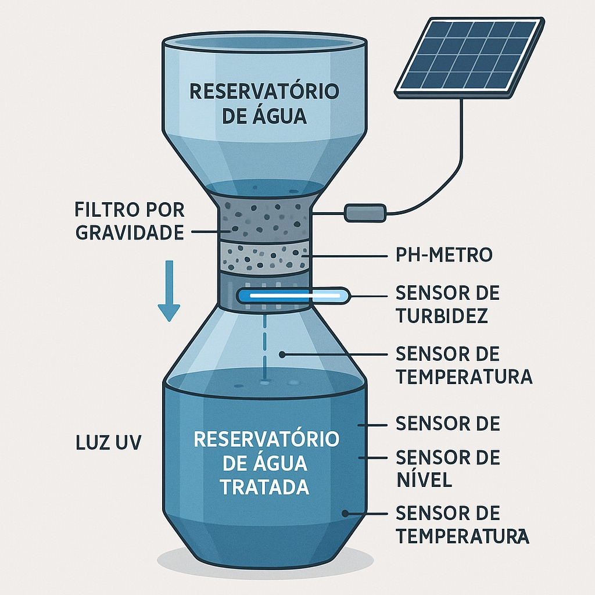
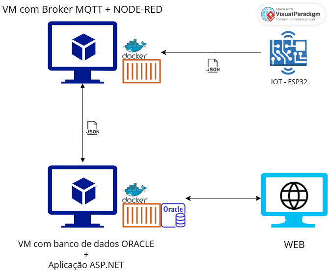

# $FonteViva – Estação-IoT-Autônoma$

Solução voltada ao **monitoramento de recursos hídricos** em cenários de risco e emergência, utilizando sensores físicos, rede MQTT e persistência em banco de dados Oracle via API.



> Uma solução integrada para o armazenamento, reaproveitamento e tratamento inteligente da água, com controle remoto e análise de qualidade em tempo real.

## **Sobre o Projeto**

O **FonteViva** é uma mini estação de tratamento de água projetada para ser portátil, empilhável e de rápida instalação, atuando tanto em cenários de escassez quanto de excesso de água. Ela integra tecnologias sustentáveis, IoT e energia solar para garantir autonomia e eficácia.

### _Componentes do Sistema_

- **Tanque superior:** Armazena água bruta (capacidade: 30–40L)
- **Filtro por gravidade:** Com carvão ativado e camadas filtrantes
- **Controle eletrônico:**
  - Medição de pH, turbidez, temperatura e volume
  - Luz UV para controle microbiológico
  - Comunicação via rede local (MQTT ou HTTP)
- **Energia limpa:** Painel solar alimentando sensores e sistema

### _Estimativa de Custos da Estação FonteViva_

| Item                                   | Descrição                           | Estimativa (R\$) |
| -------------------------------------- | ----------------------------------- | ---------------- |
| Tanque plástico                        | Reservatório superior de água (40L) | R\$ 50,00        |
| Filtro por gravidade                   | Camadas de cascalho, areia e carvão | R\$ 60,00        |
| Sensor de pH                           | Medição da acidez                   | R\$ 45,00        |
| Sensor de turbidez                     | Verifica partículas em suspensão    | R\$ 40,00        |
| Sensor de temperatura                  | Monitoramento térmico da água       | R\$ 30,00        |
| Sensor de nível (ultrassônico)         | Medição de volume disponível        | R\$ 50,00        |
| Módulo UV (esterilização)              | Controle de micro-organismos        | R\$ 70,00        |
| ESP32 / ESP8266                        | Microcontrolador com Wi-Fi          | R\$ 35,00        |
| Módulo MQTT / rede local               | Comunicação dos dados               | R\$ 10,00        |
| Painel solar + controlador + bateria   | Energia limpa e sustentável         | R\$ 150,00       |
| Estrutura física (bomba, tubos, caixa) | Instalação e vedação                | R\$ 90,00        |
| Total estimado por unidade             |                                     | **\~R\$ 630,00** |

> Valores podem reduzir com a parceria de fornecedores.

### _Viabilidade_

A proposta é financeiramente acessível, de fácil transporte (empilhável como copos plásticos) e utiliza energia limpa. Ideal para contextos de emergência, comunidades isoladas ou educação ambiental.

### _Visão Geral da Solução_

A arquitetura implementada conecta um protótipo físico (ESP32) com sensores ambientais a um sistema de backend em nuvem, garantindo:

- Coleta de dados em tempo real
- Envio via MQTT (Mosquitto)
- Processamento no Node-RED
- Persistência via API RESTful em banco Oracle

---

## **Arquitetura da Solução**

- **Backend**: ASP.NET 8.0
- **Banco de Dados**: Oracle XE 21c
- **Containerização**: Docker
- **Rede Docker**: `fonteviva-net`
- **Volumes**: `oracle-data`



---

## **Índice**

1. [Modelagem Relacional](#1-modelagem-relacional)
2. [Criação das tabelas](#2-criação-das-tabelas)
3. [Procedures](#3-procedures)
4. [Funções](#4-funções-para-retorno-de-dados-processados)
5. [Blocos anônimos](#5-bloco-anônimo-com-consultas-complexas)
6. [Cursores](#6-cursores-explícitos)
7. [Consultas](#7-consultas-sql-complexas])
8. [Integração com outros projetos](#8-integração-com-outro-projeto)

## **1. Modelagem Relacional**


#### [Voltar](#índice)

## **2. Criação das tabelas**

- [Create Table](/table/create_table.sql)

#### [Voltar](#índice)

## **3. Procedures**

- [Create Procedures](/data/procedures_create.sql)

- [Insert com Procedures](/data/procedures_inserts.sql)

#### [Voltar](#índice)

## **4. Funções para retorno de dados processados**

- [Functions](/data/function.sql)

```sql
CREATE OR REPLACE FUNCTION FUNC_MEDIA_VALOR_POR_SENSOR (
    V_TIPO_SENSOR IN VARCHAR2
) RETURN NUMBER IS
    V_MEDIA NUMBER;
BEGIN
    SELECT AVG(NR_RESULTADO)
    INTO V_MEDIA
    FROM T_FV_REGISTRO_MEDIDA R
    JOIN T_FV_SENSOR S ON R.ID_SENSOR = S.ID_SENSOR
    WHERE S.TP_SENSOR = V_TIPO_SENSOR;

    RETURN  ROUND(V_MEDIA, 4);
EXCEPTION
    WHEN NO_DATA_FOUND THEN
        RETURN NULL;
END;
/
```


```sql
CREATE OR REPLACE FUNCTION FUNC_TOTAL_POR_FORNECEDOR(
    V_CNPJ IN CHAR
) RETURN NUMBER IS
    V_TOTAL NUMBER := 0;
    BEGIN
        SELECT SUM(NR_QUANT_ESTOQUE * NR_PRECO_UNIDADE) INTO V_TOTAL
        FROM T_FV_MATERIAL
        WHERE DS_CNPJ = V_CNPJ;

    RETURN ROUND(V_TOTAL, 2);
EXCEPTION
    WHEN NO_DATA_FOUND THEN
        RETURN NULL;
    WHEN OTHERS THEN
        RETURN NULL;
END;
/
```


#### [Voltar](#índice)

## **5. Bloco anônimo com consultas complexas**

- [Bloco Anônimo](/data/bloco_anonimo.sql)

```sql
-- monitoramento de pH por responsável
DECLARE
    CURSOR c_ph IS
        SELECT
            r.NR_RESULTADO AS VALOR_PH,
            rs.NM_RESPONSAVEL,
            r.DT_REGISTRO
        FROM T_FV_REGISTRO_MEDIDA r
        JOIN T_FV_SENSOR s ON s.ID_SENSOR = r.ID_SENSOR
        JOIN T_FV_ESTACAO_TRATAMENTO e ON e.ID_ESTACAO_TRATAMENTO = s.ID_ESTACAO_TRATAMENTO
        JOIN T_FV_RESPONSAVEL rs ON rs.DS_CPF = e.DS_CPF
        WHERE s.TP_SENSOR = 'PH'
        ORDER BY r.DT_REGISTRO;

    v_valor NUMBER;
    v_nome  T_FV_RESPONSAVEL.NM_RESPONSAVEL%TYPE;
    v_data  DATE;
    v_classificacao VARCHAR2(10);
BEGIN
    OPEN c_ph;
    LOOP
        FETCH c_ph INTO v_valor, v_nome, v_data;
        EXIT WHEN c_ph%NOTFOUND;

        IF v_valor > 7.5 THEN
            v_classificacao := 'BASICO';
        ELSIF v_valor < 6.5 THEN
            v_classificacao := 'ACIDO';
        ELSE
            v_classificacao := 'NEUTRO';
        END IF;

        DBMS_OUTPUT.PUT_LINE(TO_CHAR(v_data, 'YYYY-MM-DD') || ' Responsável: ' || v_nome || ' | pH: ' || v_valor || ' - ' || v_classificacao);
    END LOOP;
    CLOSE c_ph;
END;
/
```


```sql
-- Monitoramento geral de sensores por estação
DECLARE
    CURSOR c_estacoes IS
        SELECT e.ID_ESTACAO_TRATAMENTO, COUNT(s.ID_SENSOR) AS QTD_SENSORES
        FROM T_FV_ESTACAO_TRATAMENTO e
        LEFT JOIN T_FV_SENSOR s ON s.ID_ESTACAO_TRATAMENTO = e.ID_ESTACAO_TRATAMENTO
        WHERE e.ST_ESTACAO = 'A'
        GROUP BY e.ID_ESTACAO_TRATAMENTO;

    v_id_estacao T_FV_ESTACAO_TRATAMENTO.ID_ESTACAO_TRATAMENTO%TYPE;
    v_qtd_sensores NUMBER;
    v_status VARCHAR2(15);
BEGIN
    OPEN c_estacoes;
    LOOP
        FETCH c_estacoes INTO v_id_estacao, v_qtd_sensores;
        EXIT WHEN c_estacoes%NOTFOUND;

        IF v_qtd_sensores = 5 THEN
            v_status := 'COMPLETA';
        ELSIF v_qtd_sensores > 5 THEN
            v_status := 'EXCESSO';
        ELSE
            v_status := 'INCOMPLETA';
        END IF;

        DBMS_OUTPUT.PUT_LINE(
            'Estação: ' || v_id_estacao ||
            ' | Sensores: ' || v_qtd_sensores ||
            ' | Status: ' || v_status
        );
    END LOOP;
    CLOSE c_estacoes;
END;
/
```


#### [Voltar](#índice)

## **6. Cursores Explícitos**

- [Cursores](/data/cursores_explicitos.sql)

```sql
-- Estoque médio por tipo de material
DECLARE
    CURSOR c_materiais IS
        SELECT TP_MATERIAL, ROUND(AVG(NR_QUANT_ESTOQUE)) AS MEDIA_ESTOQUE
        FROM T_FV_MATERIAL
        GROUP BY TP_MATERIAL;

    v_tipo     T_FV_MATERIAL.TP_MATERIAL%TYPE;
    v_media    NUMBER;
BEGIN
    OPEN c_materiais;
    LOOP
        FETCH c_materiais INTO v_tipo, v_media;
        EXIT WHEN c_materiais%NOTFOUND;

        IF v_media < 20 THEN
            DBMS_OUTPUT.PUT_LINE('Tipo: ' || v_tipo || ' | MÉDIA BAIXA: ' || ROUND(v_media, 2));
        ELSE
            DBMS_OUTPUT.PUT_LINE('Tipo: ' || v_tipo || ' | Média ok: ' || ROUND(v_media, 2));
        END IF;
    END LOOP;
    CLOSE c_materiais;
END;
/
```


```sql
-- Última leitura por tipo de sensor
DECLARE
    CURSOR c_tipos IS
        SELECT DISTINCT TP_SENSOR FROM T_FV_SENSOR;

    v_tipo_sensor T_FV_SENSOR.TP_SENSOR%TYPE;
    v_id_sensor   T_FV_SENSOR.ID_SENSOR%TYPE;
    v_valor       T_FV_REGISTRO_MEDIDA.NR_RESULTADO%TYPE;
    v_data        T_FV_REGISTRO_MEDIDA.DT_REGISTRO%TYPE;
BEGIN
    OPEN c_tipos;
    LOOP
        FETCH c_tipos INTO v_tipo_sensor;
        EXIT WHEN c_tipos%NOTFOUND;

        SELECT r.ID_SENSOR, r.NR_RESULTADO, r.DT_REGISTRO
        INTO v_id_sensor, v_valor, v_data
        FROM T_FV_REGISTRO_MEDIDA r
        JOIN T_FV_SENSOR s ON s.ID_SENSOR = r.ID_SENSOR
        WHERE s.TP_SENSOR = v_tipo_sensor
        AND r.DT_REGISTRO = (
            SELECT MAX(DT_REGISTRO)
            FROM T_FV_REGISTRO_MEDIDA r2
            JOIN T_FV_SENSOR s2 ON s2.ID_SENSOR = r2.ID_SENSOR
            WHERE s2.TP_SENSOR = v_tipo_sensor
        )
        FETCH FIRST 1 ROWS ONLY;

        DBMS_OUTPUT.PUT_LINE(
            'Sensor: ' || v_tipo_sensor ||
            ' | Última leitura: ' || v_valor ||
            ' em ' || TO_CHAR(v_data, 'YYYY-MM-DD') ||
            ' (ID Sensor: ' || v_id_sensor || ')'
        );
    END LOOP;
    CLOSE c_tipos;
END;
/
```


#### [Voltar](#índice)

## **7. Consultas SQL Complexas**

- [consulta_complexa](/data/consulta_complexa.sql)

```sql
-- Quantidade de sensores por estação
select e.id_estacao_tratamento,
       count(s.id_sensor) as qtd_sensores
  from t_fv_estacao_tratamento e
  join t_fv_sensor s
on e.id_estacao_tratamento = s.id_estacao_tratamento
 group by e.id_estacao_tratamento
 order by qtd_sensores desc;
```


```sql
-- Quantidade de materiais por tipo
select tp_material,
       count(*) as qtd_material
  from t_fv_material
 group by tp_material
having count(*) >= 1
 order by qtd_material desc;

```


```sql
-- Responsáveis que não têm estação associada
select r.nm_responsavel
  from t_fv_responsavel r
 where not exists (
   select 1
     from t_fv_estacao_tratamento e
    where e.ds_cpf = r.ds_cpf
);
```


```sql
-- Estações com status e quantidade de sensores instalados
select e.id_estacao_tratamento,
       e.st_estacao,
       count(s.id_sensor) as qtd_sensores
  from t_fv_estacao_tratamento e
  left join t_fv_sensor s
on e.id_estacao_tratamento = s.id_estacao_tratamento
 group by e.id_estacao_tratamento,
          e.st_estacao
 order by qtd_sensores desc;

```


```sql
-- Total investido por fornecedor
select f.ds_cnpj,
       sum(m.nr_quant_estoque * m.nr_preco_unidade) as total_estoque
  from t_fv_fornecedor f
  join t_fv_material m
on f.ds_cnpj = m.ds_cnpj
 group by f.ds_cnpj
 order by total_estoque desc;

```


#### [Voltar](#índice)

## **8. Integração com outros projetos**

O banco de dados Oracle foi utilizado em diferentes frentes do projeto, servindo como base para a persistência dos dados em diversas disciplinas:

- **Disruptive Architectures – IoT, IOB & IA Generativa**: os dados dos sensores (como pH, turbidez, nível, temperatura e vazão) simulados por dispositivos IoT foram enviados e armazenados em tabelas do banco Oracle via integração com o Node-RED e Mosquitto (MQTT).

- **DevOps Tools & Cloud Computing**: o banco foi hospedado em uma VM Linux, com acesso remoto configurado, permitindo testes, deploys e integração contínua com outras camadas do sistema.

- **Framework Application (.NET)**: uma aplicação de interface para gestão de fornecedores, sensores e estações foi conectada diretamente ao banco Oracle, utilizando bibliotecas de conexão e manipulando os dados através de procedures e funções criadas na disciplina de Banco de Dados.

YouTube: [Link do video]()

#### [Voltar](#índice)

## **Repositórios**

- GitHub: [DEVOPS-TOOLS-CLOUD-COMPUTING](https://github.com/2TDSPV-GS-01/DEVOPS-TOOLS-CLOUD-COMPUTING)
- GitHub: [ADVANCED-BUSINESS-DEVELOPMENT-WITH-.NET](https://github.com/2TDSPV-GS-01/ADVANCED-BUSINESS-DEVELOPMENT-WITH-.NET)
- GitHub: [DISRUPTIVE-ARCHITECTURES-IOT-IOB-GENERATIVE-IA](https://github.com/2TDSPV-GS-01/DISRUPTIVE-ARCHITECTURES-IOT-IOB-GENERATIVE-IA)

---

## **Integrantes**

- Nome: Francesco Di Benedetto
  RM: RM557313
- Nome: Nathalia Gomes da Silva
  RM: RM554945
- Nome: Gustavo Goulart Bretas
  RM: RM555708
